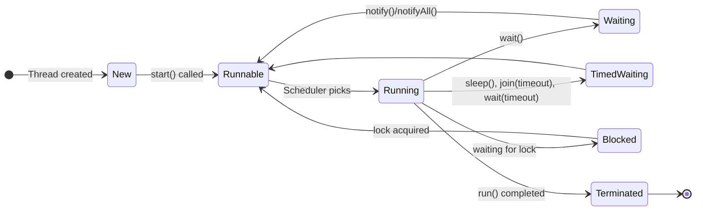

---
## 🔹 What is Multithreading?

Multithreading is a process of executing **multiple threads (lightweight sub-processes)** simultaneously within a program.  
Each thread runs independently but shares the same memory space (heap) of the process.

✅ Example use cases:

- Handling multiple client requests in a server
    
- Background tasks (e.g., autosaving, UI rendering, etc.)
    
- Parallel processing (splitting work into parts)
    

---

## 🔹 Thread Lifecycle

A thread in Java goes through these states:

1. **New** – Thread created but not started (`new Thread()`).
    
2. **Runnable** – Ready to run, waiting for CPU.
    
3. **Running** – Actively executing.
    
4. **Waiting / Timed Waiting** – Temporarily paused.
    
5. **Terminated (Dead)** – Execution finished.

## 🔹 Ways to Create a Thread in Java

There are mainly **two ways**:

1. By extending `Thread` class

```java
public class MyThread extends Thread{
	public void run(){
		System.out.println("Thread running" + Thread.currentThread().getName());
	}
}

public static class Main{
	public static void main(String[] args){
		MyThread thread = new MyThread;
		thread.start();
	}
}
```

2. By implementing `Runnable` interface

```java
class MyRunnable implements Runnable {
    public void run() {
        System.out.println("Runnable running: " + Thread.currentThread().getName());
    }
}

public class Main {
    public static void main(String[] args) {
        Thread t1 = new Thread(new MyRunnable());
        t1.start();
    }
}
```

## 🔹 Thread Methods

- `start()` → starts execution in a new thread.
    
- `run()` → contains the code to be executed (don’t call directly unless sequential).
    
- `sleep(ms)` → pauses thread.
    
- `join()` → waits for a thread to finish.
    
- `yield()` → gives chance to other threads.
    
- `setPriority(int)` → set priority (1 to 10).
    
- `isAlive()` → check if thread is still running.

# Java Thread Lifecycle



## 🔹 What is a Monitor Lock?

- Every **object in Java has an intrinsic lock (monitor lock)**.
    
- When a thread enters a **synchronized block/method**, it must first acquire the object’s lock.
    
- While one thread holds the lock, no other thread can enter any synchronized block/method **on the same object**.
    
- When the thread exits the block/method, the lock is released.


