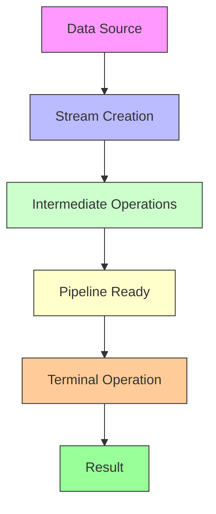

---

## **1. What is Stream API in Java?**

- Introduced in **Java 8**.
    
- Allows **functional-style operations** on collections of elements.
    
- Stream does **not store data**, but **computes elements on demand**.
    
- Supports **parallel and sequential execution**.
    
- Main idea: **Process data in a pipeline** (source → zero or more intermediate operations → terminal operation).
    

**Key Points:**

1. **No storage**: Stream does not store data.
    
2. **Functional in nature**: Operations are performed using lambda expressions.
    
3. **Laziness**: Computation happens when a terminal operation is invoked.
    
4. **Can be parallel**: Use `.parallelStream()` for multi-threaded operations.

## **2. Stream Operations**

**a) Intermediate Operations**

- **Definition:**  
    Operations in a stream pipeline that **transform a Stream into another Stream**.  
    They do **not produce a final result immediately**.
    
- **Key Characteristics:**
    
    1. **Lazy** → They don’t run immediately, only when a terminal operation is called.
        
    2. **Return Stream** → Each intermediate operation returns a new stream.
        
    3. **Composable** → You can chain multiple intermediate operations.
        
    4. **Stateless vs Stateful** → Some need to process the whole stream (`sorted`, `distinct`), others process elements independently (`map`, `filter`).

- `filter()` → filter elements
    
- `map()` → transform elements
    
- `flatMap()` → flatten streams
    
- `distinct()` → remove duplicates
    
- `sorted()` → sort elements
    
- `peek()` → debug elements
    

**b) Terminal Operations** (produce result)

- `forEach()` → iterate
    
- `collect()` → convert to collection
    
- `reduce()` → combine elements
    
- `count()` → count elements
    
- `anyMatch()`, `allMatch()`, `noneMatch()` → predicates
    
- `findFirst()`, `findAny()` → get elements

