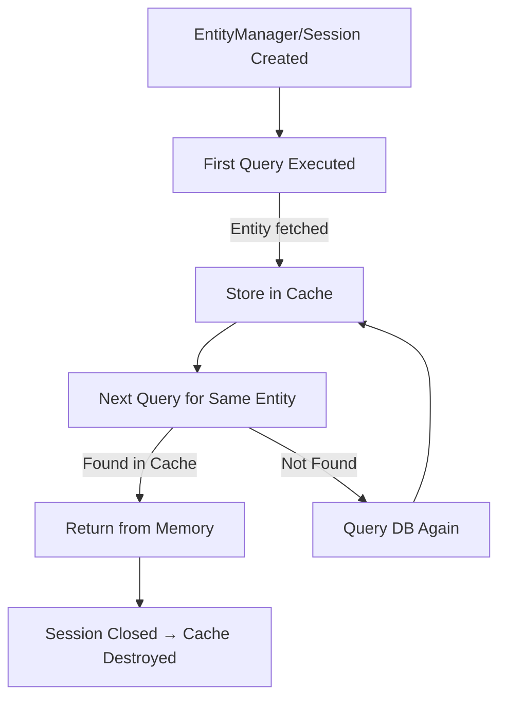

---
**First-level cache** is a **Session-level** (or **EntityManager-level**) cache provided by **Hibernate (JPA’s default ORM)**.  
It is **enabled by default** and **cannot be disabled**.

This cache exists **within the scope of a single transaction or persistence context** — meaning:

- It stores entities that are already fetched from the database.
    
- If the same entity is requested again, Hibernate retrieves it from memory (cache), not the DB.

```java
@Entity
public class Employee {
    @Id
    private Long id;
    private String name;
}
```

```java
@Service
@Transactional
public class EmployeeService {
    
    @Autowired
    private EntityManager entityManager;
    
    public void example() {
        // 1st fetch — hits DB and stores in first-level cache
        Employee emp1 = entityManager.find(Employee.class, 1L);

        // 2nd fetch — served from cache, no SQL query
        Employee emp2 = entityManager.find(Employee.class, 1L);

        System.out.println(emp1 == emp2); // true (same object from cache)
    }
}
```

- Both `emp1` and `emp2` point to the **same object in memory**.
    
- Hibernate checks the **persistence context** (cache) before querying the database.

## 🔁 Lifecycle of First-Level Cache

|Event|Effect|
|---|---|
|✅ `Session` / `EntityManager` created|Cache starts|
|🧱 Entity loaded|Stored in cache|
|♻️ `flush()`|Synchronizes cache with DB (writes changes)|
|❌ `clear()`|Empties cache|
|📴 `close()`|Cache destroyed|

## 🧹 Cache Management Methods

|Method|Description|
|---|---|
|`entityManager.clear()`|Clears entire cache (removes all managed entities)|
|`entityManager.detach(entity)`|Removes a specific entity from cache|
|`entityManager.contains(entity)`|Checks if an entity is in the persistence context|
|`entityManager.flush()`|Forces synchronization of cache → DB|

## 📊 Behavior Summary

|Action|Database Hit?|
|---|---|
|First `find()` call|✅ Yes|
|Second `find()` (same ID, same session)|❌ No|
|After `clear()` or `close()`|✅ Yes|
|Different `EntityManager`|✅ Yes|

## 🧩 Key Points

- Scope: **Single `EntityManager` / Transaction**
    
- Default: **Enabled automatically**
    
- Level: **Mandatory (cannot disable)**
    
- Stores: **Entities, not queries**
    
- Benefit: Reduces redundant SQL queries
    
- Limitation: Does **not** work across sessions or transactions


