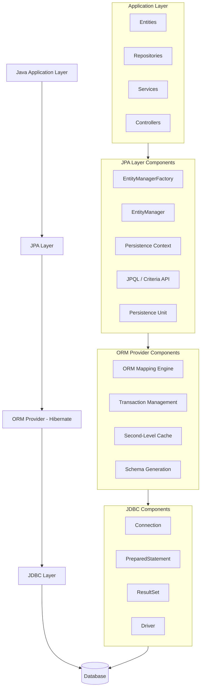

---
**JPA (Java Persistence API)** is a **specification** for **object-relational mapping (ORM)** in Java.  
It defines how Java objects map to database tables, but it doesn’t provide implementation.

➡️ Implementations of JPA include:

- **Hibernate (most common)**
    
- EclipseLink
    
- OpenJPA
    

Spring Boot uses **Spring Data JPA**, which builds on top of **Hibernate** and simplifies database access.

## 🏗️ Basic Setup

### 1. Dependencies (`pom.xml`)

```xml
<dependency>
    <groupId>org.springframework.boot</groupId>
    <artifactId>spring-boot-starter-data-jpa</artifactId>
</dependency>

<dependency>
    <groupId>com.mysql</groupId>
    <artifactId>mysql-connector-j</artifactId>
</dependency>
```

### 2. Configuration (`application.properties`)

```
spring.datasource.url=jdbc:mysql://localhost:3306/demo spring.datasource.username=root 
spring.datasource.password=root  

# Hibernate (JPA) properties 
spring.jpa.hibernate.ddl-auto=update 
spring.jpa.show-sql=true spring.jpa.properties.hibernate.dialect=org.hibernate.dialect.MySQL8Dialect
```

## 🧱 JPA Components

### 1. **Entity**

Represents a table in the database.


```java
import jakarta.persistence.*;  
@Entity @Table(name = "users") 
public class User {     
	@Id     
	@GeneratedValue(strategy = GenerationType.IDENTITY)     
	private Long id;      
	private String name;     
	private String email;      
	// getters, setters, constructors 
}
```

### 2. **Repository**

Provides CRUD operations through interfaces — no implementation needed.

```java
import org.springframework.data.jpa.repository.JpaRepository;  
public interface UserRepository extends JpaRepository<User, Long> {    List<User> findByName(String name);
}
```

### 3. **Service Layer (Optional)**

Encapsulates business logic.

```java
import org.springframework.stereotype.Service;
import java.util.List;  
@Service public class UserService {     
	private final UserRepository repo;      
	public UserService(UserRepository repo) {         
		this.repo = repo;     
	}      
	public List<User> getAllUsers() {         
		return repo.findAll();     
	}      
	public User saveUser(User user) {         
		return repo.save(user);     
	} 
}
```


### 4. **Controller**

Exposes REST endpoints.

```java
import org.springframework.web.bind.annotation.*; 
import java.util.List;
  
@RestController 
@RequestMapping("/users") public class UserController {     
	private final UserService service;      
	public UserController(UserService service) {         
		this.service = service;     
	}      
	@GetMapping     
	public List<User> getUsers() {         
		return service.getAllUsers();     
	}      
	
	@PostMapping     
	public User addUser(@RequestBody User user) {         
		return service.saveUser(user);     
	}
}
```

🏗️ JPA Architecture Diagram




