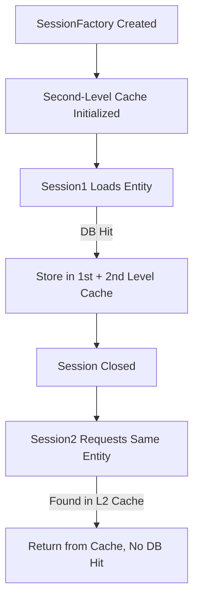

---
**Second-level cache (L2 cache)** is a **SessionFactory-level** cache in Hibernate.  
Unlike the **first-level cache (Session/EntityManager scoped)**, the **second-level cache**:

- Is **shared across multiple sessions**.
    
- Persists entities beyond a single transaction.
    
- Must be **explicitly enabled and configured**.

## ⚙️ Purpose

To reduce **database access across transactions** by storing entities, collections, and query results in memory or a distributed cache.

✅ **Used when**:

- The same entity data is frequently read.
    
- Data doesn’t change often.
    
- You want to reduce database load in read-heavy systems.

## 🧩 Difference Between First and Second Level Cache

|Feature|First-Level Cache|Second-Level Cache|
|---|---|---|
|**Scope**|Single `Session` / `EntityManager`|Shared across sessions (global)|
|**Enabled By Default**|✅ Yes|❌ No|
|**Storage**|Memory of session|External cache provider (Ehcache, Hazelcast, Redis, etc.)|
|**Control**|Automatic|Must configure in `application.properties`|
|**Usage**|Mandatory|Optional|

## 🧱 Example Setup (Using Ehcache)

### Step 1: Add Dependency

```xml
<!-- Maven --> 
<dependency>    
	<groupId>org.hibernate.orm</groupId>     
	<artifactId>hibernate-ehcache</artifactId> 
</dependency>
```

### Step 2: Enable Second-Level Cache in `application.properties`

```properties
# Enable second-level cache spring.jpa.properties.hibernate.cache.use_second_level_cache=true  

# Enable query cache (optional) spring.jpa.properties.hibernate.cache.use_query_cache=true  

# Specify the cache region factory (Ehcache 3) spring.jpa.properties.hibernate.cache.region.factory_class=org.hibernate.cache.ehcache.EhCacheRegionFactory  

# Optional (for debug) 
spring.jpa.show-sql=true 
spring.jpa.properties.hibernate.format_sql=true
```

### Step 3: Annotate Entity for Caching

```java
import jakarta.persistence.*; 
import org.hibernate.annotations.Cache; 
import org.hibernate.annotations.CacheConcurrencyStrategy;  

@Entity 
@Cacheable 
@Cache(usage = CacheConcurrencyStrategy.READ_WRITE) // or NONSTRICT_READ_WRITE, READ_ONLY 

public class Employee {      
	@Id     
	private Long id;     
	private String name; 
}
```

### Step 4: Create `ehcache.xml`

Place in `src/main/resources/ehcache.xml`


```xml
<ehcache xmlns:xsi="http://www.w3.org/2001/XMLSchema-instance"          xsi:noNamespaceSchemaLocation="ehcache.xsd">     

<!-- Default cache -->     
<defaultCache             
	maxEntriesLocalHeap="1000"             
	eternal="false"             
	timeToIdleSeconds="300"             
	timeToLiveSeconds="600"             
	statistics="true"/>      

<!-- Cache region for Employee entity -->     
	<cache 
		name="com.example.demo.entity.Employee"            
		maxEntriesLocalHeap="100"            
		timeToIdleSeconds="300"            
		timeToLiveSeconds="600"            
		eternal="false"            
		statistics="true"/> 
</ehcache>
```


## ⚙️ Cache Concurrency Strategies

|Strategy|Description|Use Case|
|---|---|---|
|**READ_ONLY**|Data never changes|Reference/static data (e.g., countries)|
|**NONSTRICT_READ_WRITE**|Occasional updates, no strict locking|Mostly-read data|
|**READ_WRITE**|Uses soft locks for consistency|Frequently updated entities|
|**TRANSACTIONAL**|For JTA environments|Rare in typical apps|



