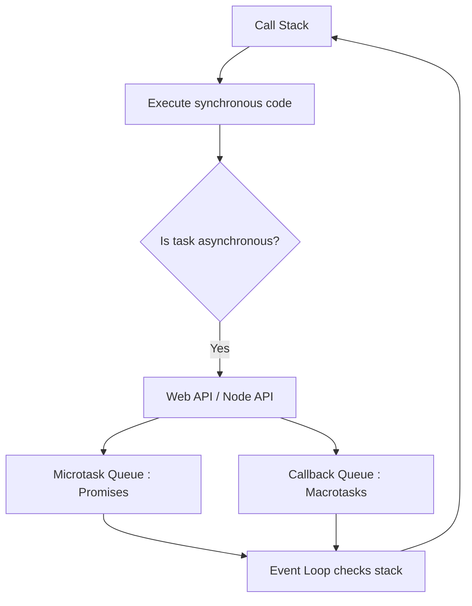

---
## 1. What is Asynchronous Programming?

- Allows JS to perform **long-running operations** (API calls, timers, file I/O) **without blocking** the main thread.
    
- JS is **single-threaded**, so synchronous code blocks execution; async code lets other code run while waiting for tasks.
    

### Example: Synchronous (blocking)

```js
console.log("Start"); 
for(let i=0; i<1e9; i++) {} 
console.log("End");
```

### Example: Asynchronous (non-blocking)

```js
console.log("Start"); 
setTimeout(() => console.log("Inside timeout"), 2000);
console.log("End");
```

Output:

```
Start 
End
Inside timeout
```

---

## 2. Common Asynchronous Patterns

### a) Callbacks

- Function passed as an argument to execute later.
    

```js
function fetchData(callback) {     
	setTimeout(() => callback("Data received"), 2000); 
} 
fetchData(data => console.log(data));
```

> ⚠️ Can lead to **callback hell** if nested deeply.

### b) Promises

- Represents a value **available now, later, or never**.
    

```js
let promise = new Promise((resolve, reject) => {     
	setTimeout(() => resolve("Data received"), 2000); 
	}); 
	promise.then(data => console.log(data))        
	.catch(err => console.log(err));
```

**States:** `Pending`, `Fulfilled`, `Rejected`.

### c) async / await

- Cleaner syntax to handle promises.
    

```js
async function getData() {     
	console.log("Start");     
	const data = await fetchData(); // waits asynchronously 
	console.log(data);         
	console.log("End"); 
} 
getData();
```

# JavaScript Event Loop 🔄

## 1. Overview

- JS is **single-threaded** → executes one task at a time on the **call stack**.
    
- **Asynchronous tasks** (timers, promises, network requests) are handled by **Web APIs / Node APIs**.
    
- **Event loop** manages execution of tasks by checking the call stack and queues.
    

---

## 2. Components

### a) Call Stack

- Executes **synchronous code**.
    
- Works in **LIFO** (Last In, First Out) order.
    

### b) Callback Queue 

- Holds **callbacks from asynchronous operations** like:
    
    - `setTimeout`, `setInterval`
        
    - DOM events (click, load)
        
    - I/O operations
        
- Executed **after current call stack is empty**.

### c) Microtask Queue

- Holds **Promise callbacks and `queueMicrotask`**.
    
- Executed **before the next  callback**, immediately after the current stack is empty.

---

## 3. Flow of Execution

1. Execute **synchronous code** from top to bottom (call stack).
    
2. Move **ready microtasks** to call stack and execute **all**.
    
3. Move **one macrotask** from callback queue to call stack.
    
4. Repeat: empty call stack → run all microtasks → run next macrotask → …




