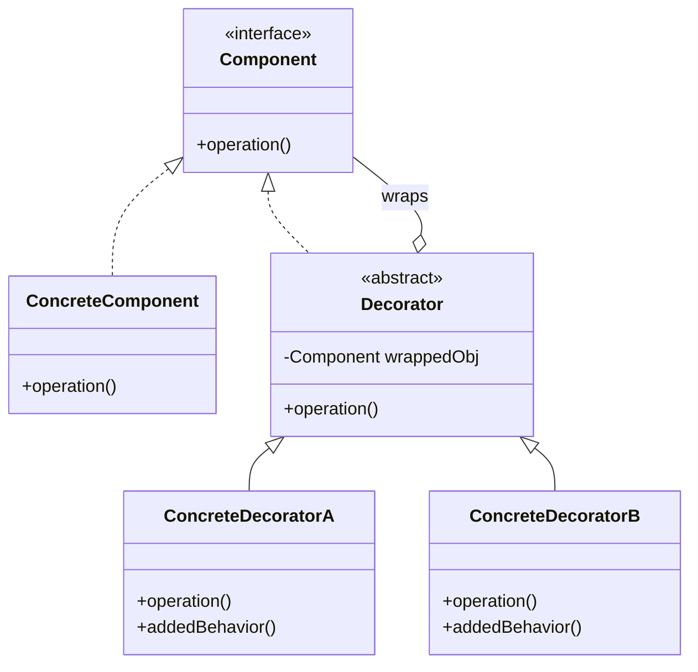

---
#Overview

The Decorator pattern is a **structural design pattern** that allows you to attach new behaviors to objects dynamically by placing these objects inside special wrapper objects called decorators. It provides a flexible alternative to subclassing for extending functionality.

