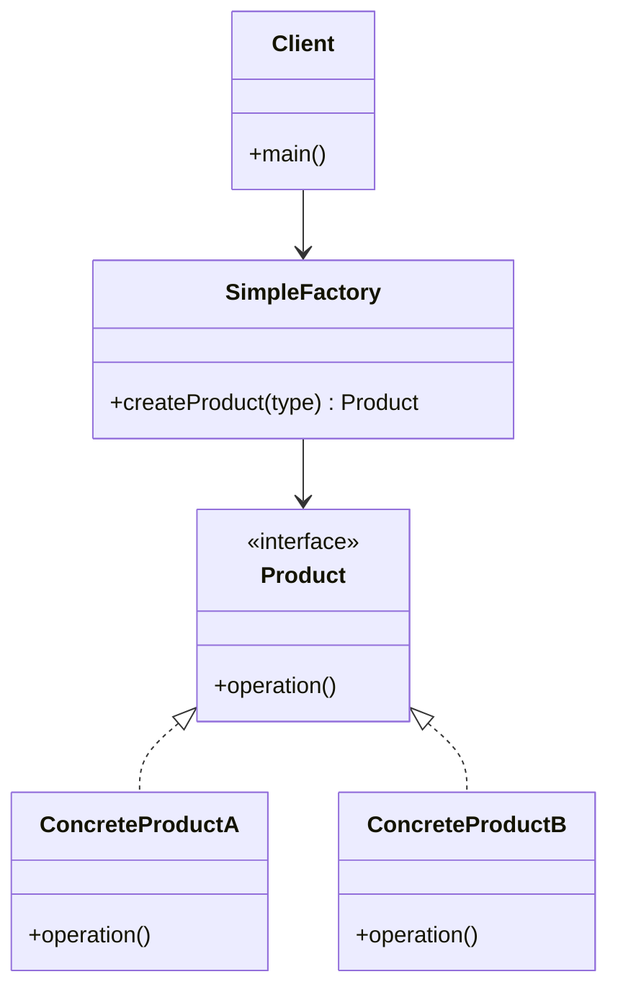
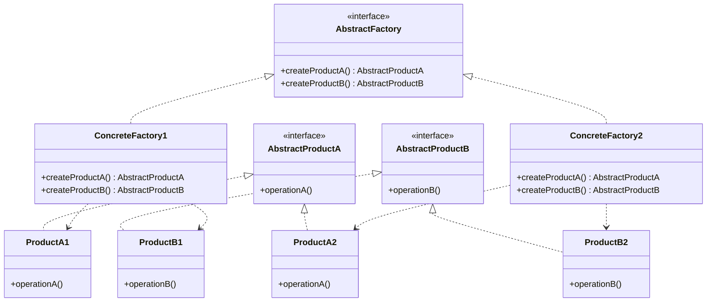

---

## Overview

The Factory pattern is a **creational design pattern** that provides an interface for creating objects without specifying their exact classes. It encapsulates object creation logic and promotes loose coupling by eliminating the need to bind application-specific classes into the code.

Types of Factory Patterns :

1. **Simple Factory** (not a formal pattern, but widely used)
2. **Abstract Factory** (formal GoF pattern)

Abstract Factory Pattern :

The Abstract Factory pattern provides an interface for creating families of related or dependent objects without specifying their concrete classes.

