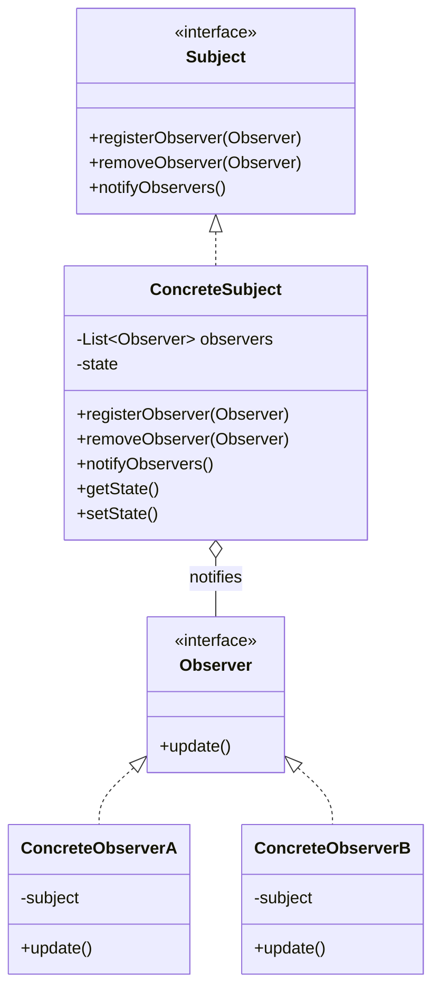

---

#Overview

The Observer pattern is a **behavioral design pattern** where an object (Subject) maintains a list of dependents (Observers) and notifies them automatically of any state changes.

#Pattern Structure

