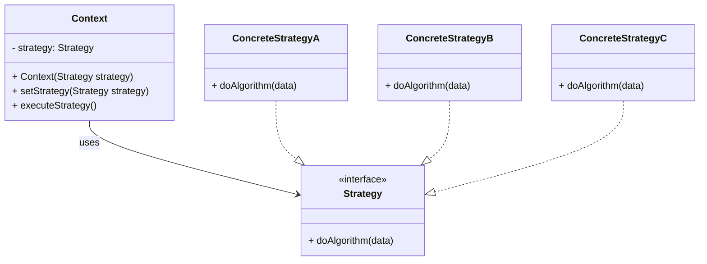

[[StratergyDesignPattern.excalidraw]]

---
**Type:** Behavioral Pattern  
**Purpose:** Let **different algorithms** be **interchangeable** at runtime.

## **1. Idea (Simple)**

- Imagine you have **multiple ways to do something**.
    
- Instead of hardcoding `if-else` everywhere, **encapsulate each way** in its own class.
    
- Let the **client pick the strategy** they want.

## **2. Key Components**

- **Strategy (interface)** → defines the algorithm.
    
- **ConcreteStrategy (class)** → implements the algorithm.
    
- **Context (class)** → uses a Strategy to perform the task.

## **3. Why Use It?**

- Avoids long `if-else` chains.
    
- Makes code **extensible** → add new strategy without changing old code.
    
- Promotes **composition over inheritance**.