---
## 🔹 1. Microservices Design Patterns (Overview)

Microservices architecture breaks a monolith into **independent, loosely coupled services**. Patterns help solve recurring challenges like service boundaries, communication, transactions, and migration.

## 🔹 2. Decomposition Patterns

These help **decide how to split a monolith into microservices**.

- **Decompose by Business Capability**
    
    - Each service = one business function (e.g., Payments, Orders, Inventory).
        
    - Best for domain-driven design (DDD).
        
- **Decompose by Subdomain (DDD approach)**
    
    - Break based on bounded contexts in domain-driven design.
        
    - Example: In e-commerce, `Checkout` and `Catalog` are separate subdomains.
        
- **Decompose by Transactions or Data Ownership**
    
    - Ensure a service owns its data, no shared DB.
        
    - Example: Order service has its own Orders DB, not shared with Payments.
        

⚠️ **Anti-pattern**: Decomposing by technical layers (UI, service, DB), as it re-creates a distributed monolith.

---
## 🔹 3. Saga Pattern (Distributed Transactions)

When a business process spans multiple services, use **Saga** instead of 2-phase commit.

Two types:

1. **Choreography (Event-based)**
    
    - Services publish/subscribe to events.
        
    - Example: Order → emits event → Payment listens → Shipping listens.

1. **Orchestration (Central Controller)**
    
    - A central orchestrator (e.g., Order service) tells each participant what to do.

```mermaid
flowchart LR
    O[Saga Orchestrator]

    O -->|Create Order| A[Order Service]
    A -->|OK| O

    O -->|Process Payment| B[Payment Service]
    B -->|OK| O
    B -.->|Fail → Cancel Order| O

    O -->|Reserve Inventory| C[Inventory Service]
    C -->|OK| O
    C -.->|Fail → Refund + Cancel| O

    O -->|Arrange Shipping| D[Shipping Service]
    D -->|OK| O
    D -.->|Fail → Release + Refund + Cancel| O

    O -->|Complete Order| A
```
        

✅ **When to use Saga Pattern?**

- When business transactions span multiple services.
    
- When you need **eventual consistency** instead of strict ACID transactions.
    
- Example: E-commerce order (Order → Payment → Inventory → Shipping).

---

## 🔹 4. Strangler Fig Pattern (Migration from Monolith)

- Used when **migrating a monolith to microservices gradually**.
    
- New functionality is built as microservices, while the monolith handles existing parts.
    
- Over time, the monolith is "strangled" as more logic moves out.
    

Example:

- Start with a monolith e-commerce app.
    
- Move "Product Catalog" to microservice.
    
- Route product-related API calls to the new service.
    
- Gradually migrate Orders, Payments, etc.

---
## ✅ CQRS Pattern Overview

- **Commands** → Write operations (create/update/delete).
    
- **Queries** → Read operations (get/fetch).
    
- Each can have **different models or databases**.
    
- Often paired with **event sourcing**, but not mandatory.

### 🔹 Explanation

1. **User sends commands** → handled by **Command Handler** → updates **Write DB**.
    
2. **User sends queries** → handled by **Query Handler** → reads from **Read DB**.
    
3. **Optional event syncing** keeps **Read DB eventually consistent** with **Write DB**.
    

✅ Benefits:

- Optimized for **high read performance**.
    
- Allows **different data models** for read and write.
    
- Scales better for systems with **many reads vs writes**.