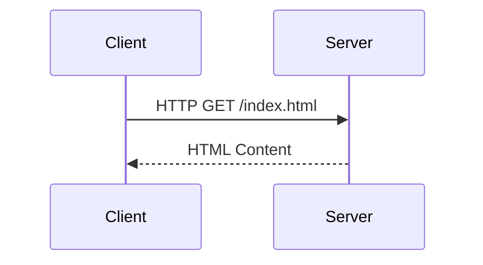
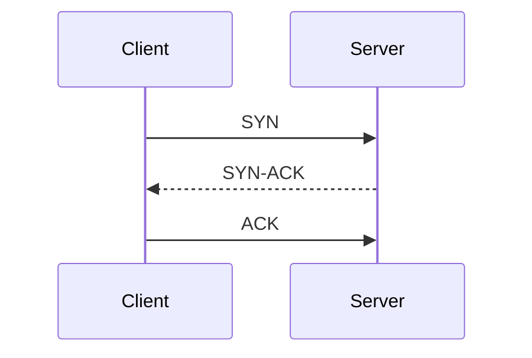
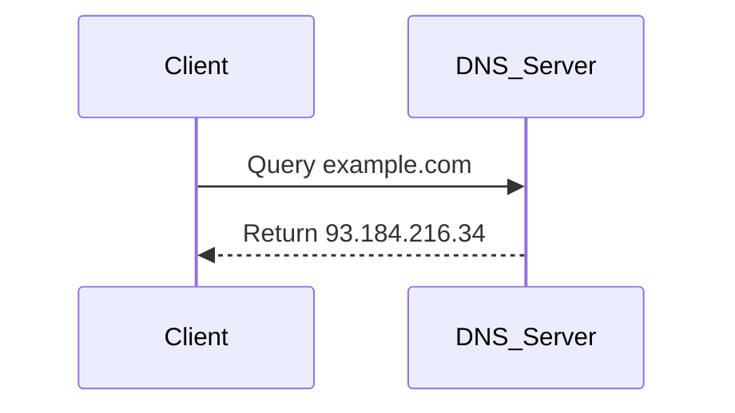
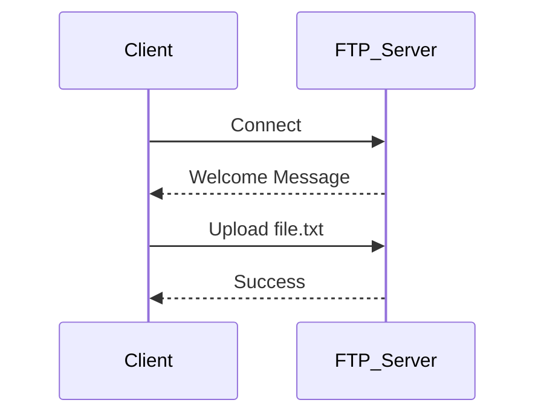

---

## **1. Network Protocols Overview**

Network protocols are rules and standards that allow computers to communicate over networks. They are typically grouped by layers based on the **OSI model** or **TCP/IP model**.

### **OSI Model Layers & Protocol Examples**

|Layer|Protocols|Purpose|
|---|---|---|
|**Application**|HTTP, HTTPS, FTP, SMTP, DNS|User-level services like web browsing, email, file transfer|
|**Transport**|TCP, UDP|Reliable/unreliable data delivery|
|**Network**|IP, ICMP, ARP|Addressing and routing packets|
|**Data Link**|Ethernet, PPP, Wi-Fi (802.11)|Physical addressing, error detection|
|**Physical**|Ethernet cables, Fiber, Wi-Fi radio|Raw bit transmission|
## **2. Common Protocols**

### **a) HTTP / HTTPS**

- Application layer protocol for web communication.
    
- HTTPS = HTTP + TLS/SSL encryption.
    

### **b) TCP / UDP**

- **TCP:** Reliable, connection-oriented.
    
- **UDP:** Fast, connectionless.
    

**TCP Connection Flow (3-way handshake):**

### **c) DNS (Domain Name System)**

- Resolves domain names to IP addresses.

### **d) FTP (File Transfer Protocol)**

- Used for transferring files.

