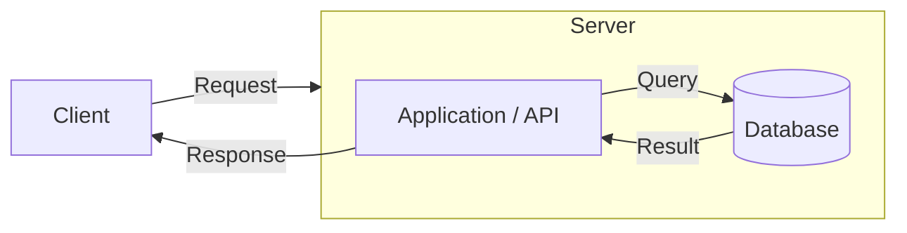
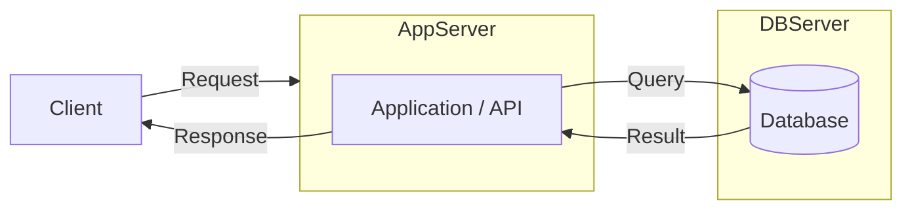
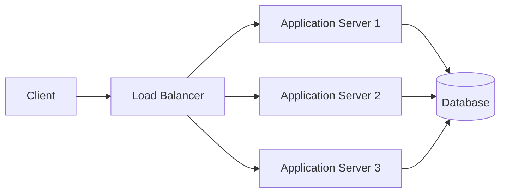
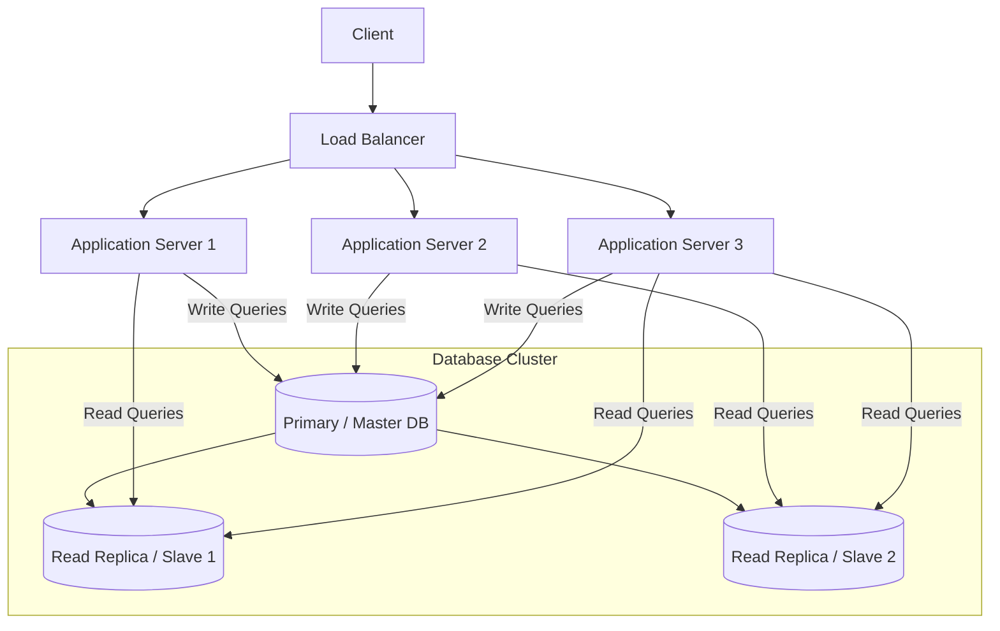
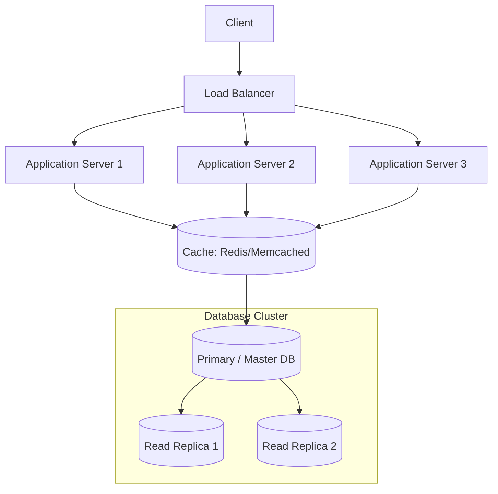
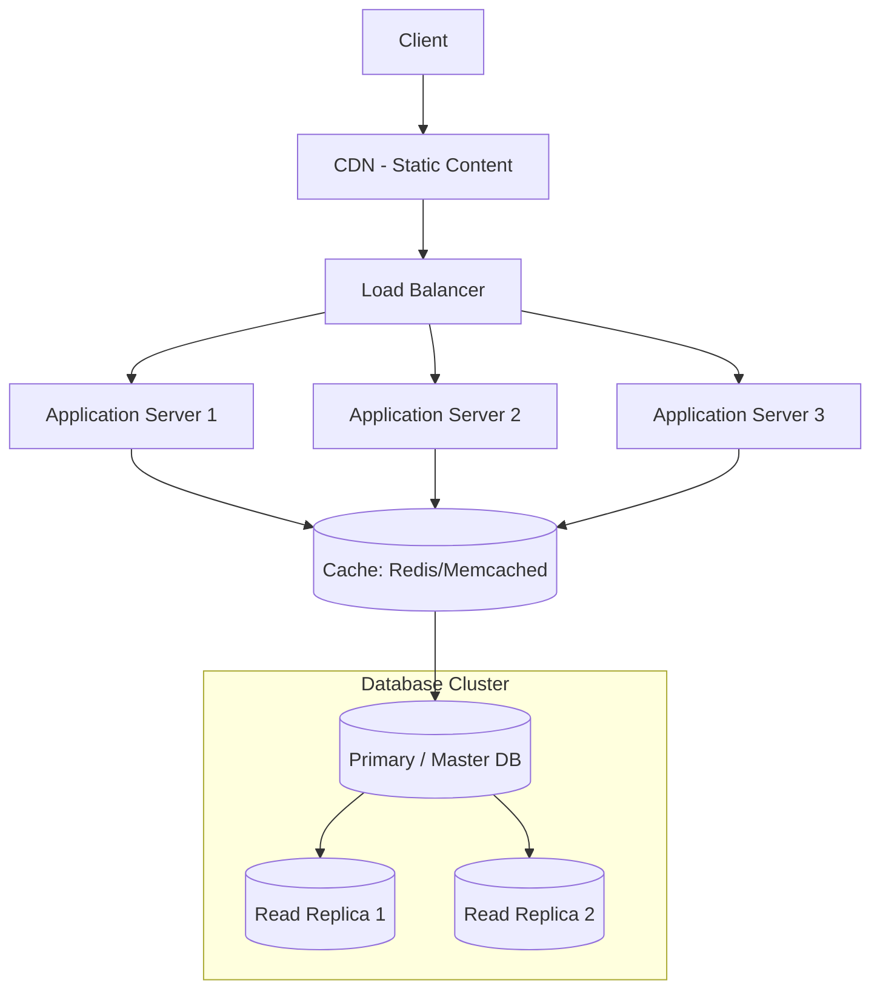

---

## **Stage 1: Single Server Architecture**

**Goal:** Launch quickly, minimal infrastructure.

**Components:**

1. **Client:** Browser or mobile app.
    
2. **Single Server:**
    
    - **Application / API:** Handles business logic and HTTP requests.
        
    - **Database:** Stores all persistent data.
        
3. **Optional Cache:** For very hot data (Redis or Memcached), but not always necessary at this stage.
    

**Characteristics:**

- All services on **one machine** (vertical scaling if needed).
    
- Low cost, easy to deploy.
    
- Simple to maintain.
    
- Bottleneck is the single server → cannot handle millions yet.

## **Stage 2: Separate App and Database Servers**

**Goal:**

- Reduce load on a single server.
    
- Allow the application and database to scale independently.
    

**Components:**

1. **Client** – browser or mobile app.
    
2. **Application Server** – handles business logic and HTTP requests.
    
3. **Database Server** – stores persistent data, can scale vertically or horizontally.

## **Stage 3: Load Balancer + Multiple Application Servers**

**Goal:**

- Distribute traffic across multiple app servers (horizontal scaling).
    
- Prevent single point of failure at the application layer.
    
- Keep the database as a single source of truth.

## **Stage 4: Database Replication**

**Flow:**

- Client → Load Balancer → Application Servers → Databases
    
- **Primary DB** (handles writes).
    
- **Read Replicas** (handle read queries, reducing load on primary).

## **Stage 5: Adding Caching Layer**

**Flow:**

1. **Client → Load Balancer → App Servers**.
    
2. App Servers first check **Cache (Redis/Memcached)**.
    
    - If data is found → return result (fast).
        
    - If not → query the Database (Primary/Replicas), then update Cache.
        
3. Database cluster still handles writes (Primary) and reads (Replicas).

## **Stage 6: Add CDN Layer**

**What it does:**

- Serves **static content** (images, CSS, JS) from servers close to users.
    

**Why it matters for scaling:**

1. **Reduces load on backend servers** → apps handle more dynamic requests.
    
2. **Improves response time** → faster for users worldwide.
    
3. **Handles traffic spikes** → prevents origin servers from being overwhelmed.

