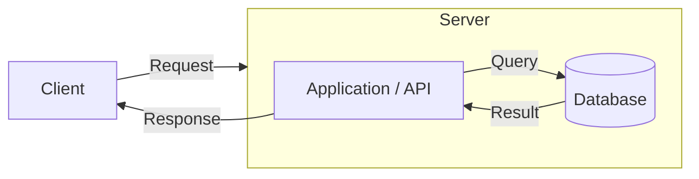
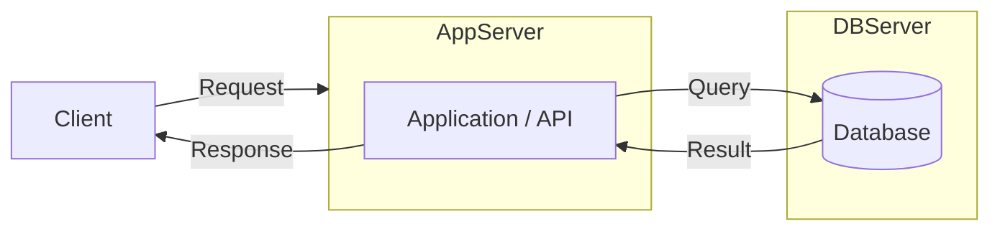
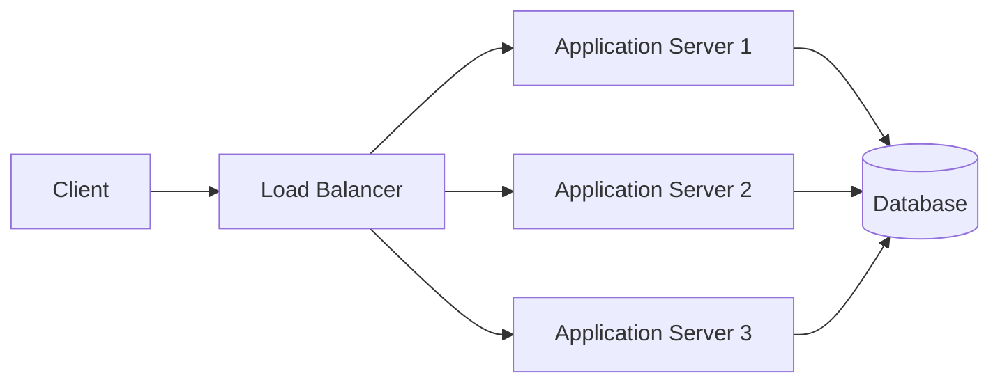
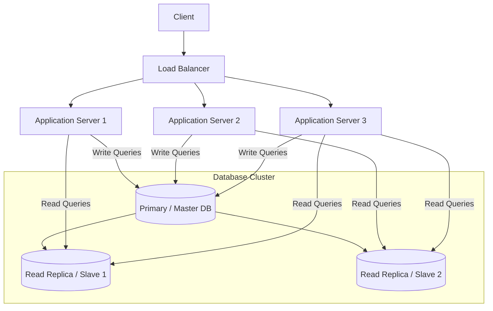
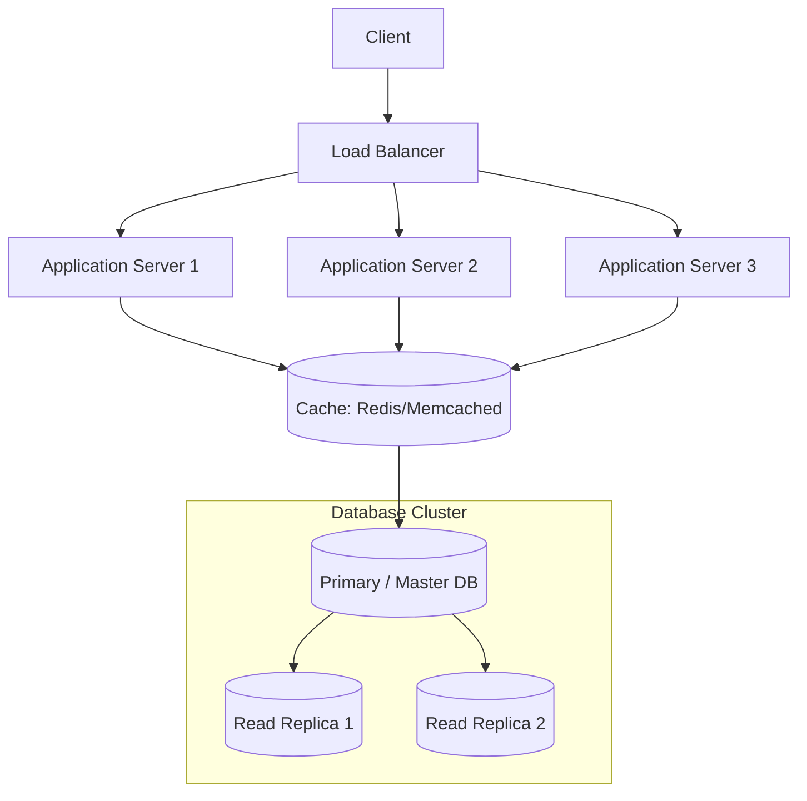
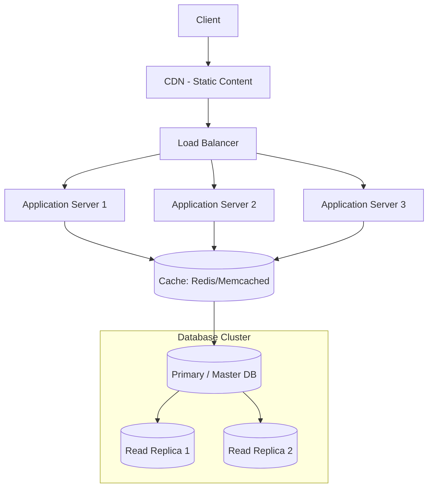
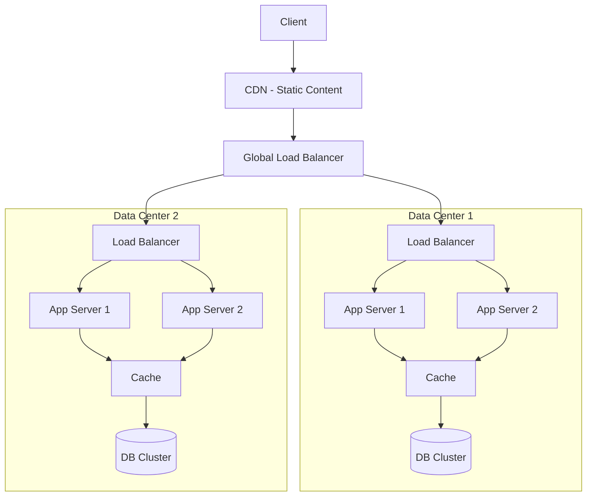
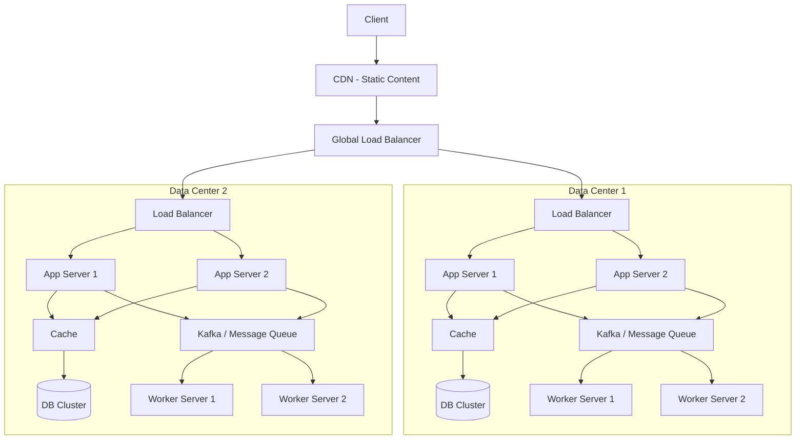
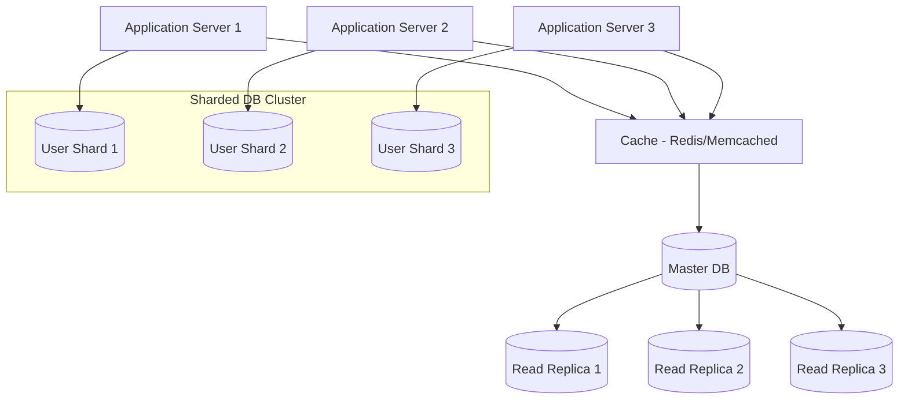

---

## **Stage 1: Single Server Architecture**

**Goal:** Launch quickly, minimal infrastructure.

**Components:**

1. **Client:** Browser or mobile app.
    
2. **Single Server:**
    
    - **Application / API:** Handles business logic and HTTP requests.
        
    - **Database:** Stores all persistent data.
        
3. **Optional Cache:** For very hot data (Redis or Memcached), but not always necessary at this stage.
    

**Characteristics:**

- All services on **one machine** (vertical scaling if needed).
    
- Low cost, easy to deploy.
    
- Simple to maintain.
    
- Bottleneck is the single server → cannot handle millions yet.

## **Stage 2: Separate App and Database Servers**

**Goal:**

- Reduce load on a single server.
    
- Allow the application and database to scale independently.
    

**Components:**

1. **Client** – browser or mobile app.
    
2. **Application Server** – handles business logic and HTTP requests.
    
3. **Database Server** – stores persistent data, can scale vertically or horizontally.

## **Stage 3: Load Balancer + Multiple Application Servers**

**Goal:**

- Distribute traffic across multiple app servers (horizontal scaling).
    
- Prevent single point of failure at the application layer.
    
- Keep the database as a single source of truth.

## **Stage 4: Database Replication**

**Flow:**

- Client → Load Balancer → Application Servers → Databases
    
- **Primary DB** (handles writes).
    
- **Read Replicas** (handle read queries, reducing load on primary).

## **Stage 5: Adding Caching Layer**

**Flow:**

1. **Client → Load Balancer → App Servers**.
    
2. App Servers first check **Cache (Redis/Memcached)**.
    
    - If data is found → return result (fast).
        
    - If not → query the Database (Primary/Replicas), then update Cache.
        
3. Database cluster still handles writes (Primary) and reads (Replicas).

## **Stage 6: Add CDN Layer**

**What it does:**

- Serves **static content** (images, CSS, JS) from servers close to users.
    

**Why it matters for scaling:**

1. **Reduces load on backend servers** → apps handle more dynamic requests.
    
2. **Improves response time** → faster for users worldwide.
    
3. **Handles traffic spikes** → prevents origin servers from being overwhelmed.

## **Stage 7: Multi-Data Center / Multi-Region Approach**

**Goal:**

- Serve users from the nearest data center → lower latency.
    
- Ensure high availability → if one data center fails, others continue serving requests.
    
- Handle **millions of users globally**.
    

### **Key Concepts for Scaling**

1. **Multiple Data Centers / Regions**
    
    - Each region has its own **App Servers, Cache, DB Cluster**.
        
    - Users are routed to the **nearest region** via DNS or Global Load Balancer.
        
2. **Global Load Balancer / DNS-based Routing**
    
    - Routes user traffic to the closest healthy data center.
        
    - Can failover if a region goes down.
        
3. **Data Replication Across Regions**
    
    - Databases replicate between regions (asynchronous replication).
        
    - Ensures eventual consistency.
        
4. **CDN Remains Global**
    
    - Static content is still served from the **nearest CDN edge**.

## **Step 8: Add Message Queues for Asynchronous Processing**

**Purpose:**

- Decouple tasks from main application flow.
    
- Let App Servers remain **fast and responsive** under heavy load.
    
- Handle **background tasks** (emails, notifications, reports, analytics) reliably.
    

### **How it Helps Scaling**

1. **Decoupling Services:** App servers don’t wait for long-running tasks.
    
2. **Independent Scaling:** Workers can scale separately from App Servers.
    
3. **Load Leveling:** Smooths spikes in traffic.
    
4. **Improved Responsiveness:** Users get faster responses.
    
5. **Reliability:** Messages persist until processed.

## **Step 9: Database Scaling**

### **1. Why Database Scaling is Needed**

- When the number of users and requests increases, a **single database can become a bottleneck**.
    
- To handle high throughput and large datasets, you need to **scale the database**.
    

### **2. Common Database Scaling Techniques**

#### **A. Vertical Scaling (Scale-Up)**

- Upgrade **CPU, RAM, or storage** of the existing DB server.
    
- Simple but limited → can’t handle indefinite growth.
    

#### **B. Horizontal Scaling (Scale-Out)**

- **Add more DB servers** and split the load. Two common approaches:
    

1. **Read Replicas**
    
    - Multiple read-only copies of the master DB.
        
    - Master handles writes; replicas handle read queries.
        
    - Improves read throughput.
        
2. **Sharding / Partitioning**
    
    - Split data across multiple DB servers based on a **sharding key**.
        
    - Each shard handles a subset of data → distributes both read and write load.
        

#### **C. Multi-Region Replication**

- DB clusters in **different regions / data centers** replicate asynchronously.
    
- Improves **availability** and **disaster recovery**.

